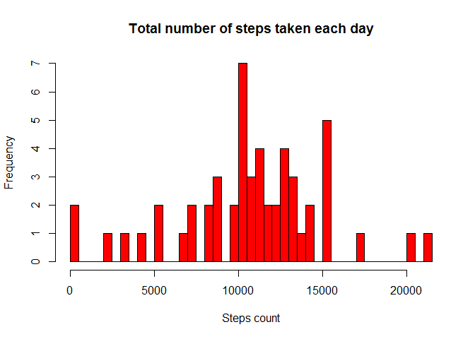
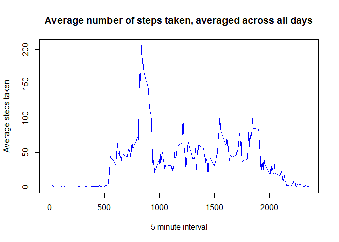
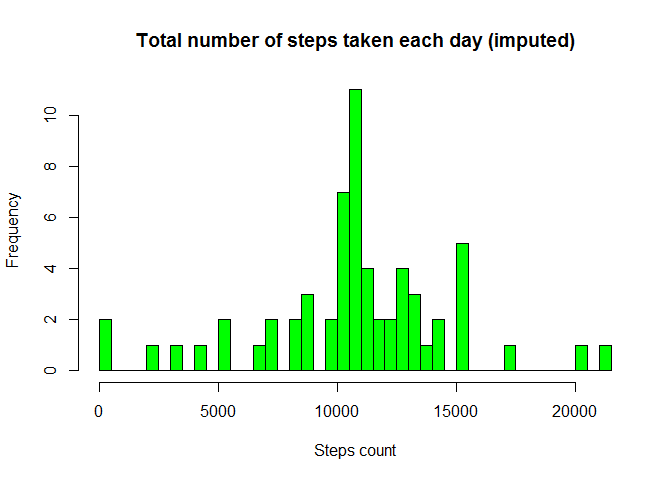

# Reproducible Research: Peer Assessment 1


## Loading and preprocessing the data

```r
# unpack data set, assuming it's in current working directory
unzip (zipfile = paste0(getwd(), "/activity.zip"), 
       exdir = getwd())

# read data set and convert to data.table 
require("data.table")
fileData <- read.csv(file = paste0(getwd(), "/activity.csv"), 
                     header = TRUE,
                     colClasses = c("numeric", "Date", "integer"))
fileData <- data.table(fileData)
```

## What is mean total number of steps taken per day?

```r
# Calculate the total number of steps taken per day
set1 <- fileData[!is.na(steps), sum(steps), by = "date"]
set1 <- setorder(set1, "date")

# Make a histogram of the total number of steps taken each day
hist(x      = set1$V1,
     col    = "red",
     xlab   = "Steps count", 
     main   = "Total number of steps taken each day",
     breaks = nrow(set1))
```

<!-- -->

```r
# Calculate and report the mean and median of 
# the total number of steps taken per day
mean.set1 <- mean(set1$V1)
median.set1 <- median(set1$V1)

cat(sprintf("Mean of steps taken per day=%f\nMedian of steps taken per day=%f\n", 
mean.set1, median.set1))
```

```
## Mean of steps taken per day=10766.188679
## Median of steps taken per day=10765.000000
```

## What is the average daily activity pattern?

```r
# Make a time series plot of the 5-minute interval (x-axis) and the average 
# number of steps taken, averaged across all days (y-axis)
set2 <- fileData[!is.na(steps), mean(steps), by = "interval"]
plot(x    = set2$interval,
     y    = set2$V1,
     col  = "blue",
     type = "l",
     xlab = "5 minute interval", 
     ylab = "Average steps taken",
     main = "Average number of steps taken, averaged across all days")
```

<!-- -->

```r
# Which 5-minute interval, on average across all the days in the dataset, 
# contains the maximum number of steps?
cat(sprintf("Maximum number of steps within 5-minute interval across all the days in the dataset=%d\n", set2$interval[set2$V1 == max(set2$V1)]))
```

```
## Maximum number of steps within 5-minute interval across all the days in the dataset=835
```

## Imputing missing values

```r
# Calculate and report the total number of missing values in the dataset
cat(sprintf("total number of missing values in the dataset=%d\n", sum(is.na(fileData$steps))))
```

```
## total number of missing values in the dataset=2304
```

```r
# Devise a strategy for filling in all of the missing values in the dataset
fileDataNA <- merge(fileData[is.na(steps), ], set2, by = "interval", sort = FALSE)

# Create a new dataset that is equal to the original dataset but with the 
# missing data filled in.
fileDataImputed <- merge(x     = fileData, 
                         y     = fileDataNA, 
                         by    = c("date","interval"), 
                         all.x = TRUE, 
                         sort  = TRUE)
fileDataImputed[is.na(steps.x)]$steps.x <- fileDataImputed[is.na(steps.x)]$V1

fileDataImputed$steps.y <- NULL
fileDataImputed$V1 <- NULL
setnames(fileDataImputed, "steps.x", "steps")

# Make a histogram of the total number of steps taken each day 
set3 <- fileDataImputed[!is.na(steps), sum(steps), by = date]
hist(x      = set3$V1,
     col    = "green",
     xlab   = "Steps count", 
     main   = "Total number of steps taken each day (imputed)",
     breaks = nrow(set3))
```

<!-- -->

```r
# Calculate and report the mean and median total number of steps taken per day. 
mean.set3 <- mean(set3$V1)
median.set3 <- median(set3$V1)

# Do these values differ from the estimates from the first part of the assignment? 
mean.diff <- mean.set1 - mean.set3
median.diff <- median.set1 - median.set3

if (mean.diff == 0) {
  cat(sprintf("Mean value is the same as it was for the data set with ignored NA values\n"))
} else {
  cat(sprintf("Mean value is different from data set with ignored NA values. Relative difference, percent: %f\n", mean.set1/mean.set3*100))
}
```

```
## Mean value is the same as it was for the data set with ignored NA values
```

```r
if (median.diff == 0) {
  cat(sprintf("Median value is the same as it was for the data set with ignored NA values\n"))
} else {
  cat(sprintf("Median value is different from data set with ignored NA values. Relative difference, percent: %f\n", (1 - median.set1/median.set3)*100))
}
```

```
## Median value is different from data set with ignored NA values. Relative difference, percent: 0.011041
```

```r
# What is the impact of imputing missing data on the estimates of the total 
# daily number of steps?
set4 <- merge(x = set1, y = set3, by = "date", all.y = TRUE, sort = TRUE)
sum.diff <- sum(set4$V1.x, na.rm = TRUE) - sum(set4$V1.y)
cat(sprintf("In the result of the missing data impute, day-to-day sum of avarage steps taken %s on: %f\n", ifelse(sum.diff < 0, "raised", "decreased"), abs(sum.diff)))
```

```
## In the result of the missing data impute, day-to-day sum of avarage steps taken raised on: 86129.509434
```

## Are there differences in activity patterns between weekdays and weekends?

```r
# Create a new factor variable in the dataset with two levels - "weekday" and 
# "weekend" indicating whether a given date is a weekday or weekend day.
fileDataImputed$dayofweek <- "weekday"
fileDataImputed[weekdays(date, TRUE) %in% c("Sat", "Sun")]$dayofweek <- "weekend"
fileDataImputed$dayofweek <- as.factor(fileDataImputed$dayofweek)

# Make a panel plot containing a time series plot of the 5-minute interval 
# (x-axis) and the average number of steps taken, averaged 
# across all weekday days or weekend days (y-axis). 
set5 <- fileDataImputed[, mean(steps), by = c("interval", "dayofweek")]
library(lattice)
xyplot(V1 ~ interval | factor(dayofweek),
       layout = c(1, 2),
       data   = set5,
       xlab   = "Interval",
       ylab   = "Number of steps",
       type   = "l",
       lty    = 1)
```

<!-- -->
